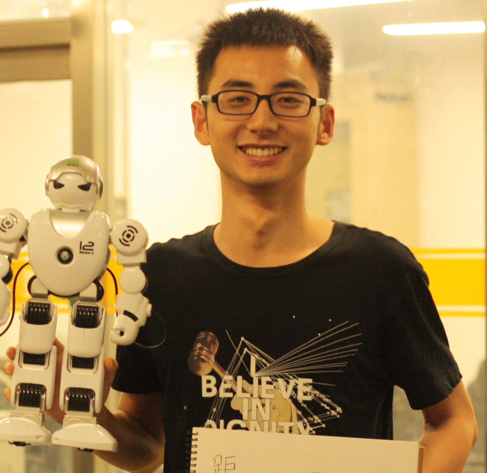

## Li Mengdi (李梦迪)

China Agricultural University  
College of Information and Electrical Engineering  
17 Tsinghua East Road Beijing, China 100083  
Email: li_mengdi@hotmail.com  
Phone: +86 13581545597  
Skepy: live:li_mengdi  
{: style="width: 500px; float: left"}

{:refdef: style="text-align: right;"}
{: height="24%" width="24%"}
{: refdef}

***
### Education

2016.9 - 2019.6 (expected):   Master of Engineering, *Computer Science*
:   College of Information and Electrical Engineering, China Agricultural University (National 985 Project University)

     * Research area: **Machine Learning and Deep Learning applications to Steganography, Multimedia Processing**

     * Advisor: Yiming Xue   &emsp;   Second Advisor: Ping Zhong
     * GPA: 3.11/4.0 (Score: 81/100)

2012.9 - 2016.6:   Bachelor of Engineering (with honors), *Electronic and Information Engineering*
:   College of Information and Electrical Engineering, China Agricultural University 

     * GPA: 3.13/4.0 (Score: 82/100)

***
### Publications
* **Mengdi Li**, Kai Mu, Ping Zhong, Juan Wen, Yiming Xue. “Generating Steganographic Image Description by Dynamic Synonym Substitution” *Signal Processing* (Accept with minor revisions)

* Ping Zhong, **Mengdi Li**, Kai Mu, Juan Wen, Yiming Xue. “Image Steganalysis in High-Dimensional Feature Spaces with Proximal Support Vector Machine” *International Journal of Digital Crime and Forensics*, 2019 ([DOI](http://doi.org/10.4018/IJDCF.2019010106), [Full Text PDF](http://blog.darkroamer.com/assets/Image Steganalysis with PSVM.pdf))

* Juan Wen, Xuejing Zhou, **Mengdi Li**, Ping Zhong. “A Novel Natural Language Steganographic Framework Based on Image Description Neural Network” *Journal of Visual Communication and Image Representation*, 2019 ([DOI](https://doi.org/10.1016/j.jvcir.2019.03.016), [Full Text PDF](http://blog.darkroamer.com/assets/natural language steganographic framework.pdf)) 
* [Google Scholar](https://scholar.google.co.jp/citations?user=0W7UjrcAAAAJ&hl=en)

***
### Honors and Awards
* **The Best 100 Graduation Thesis** of China Agricultural University in 2016 (June, 2016)
* **The Third Prize** in Beijing Contest District in National Undergraduate Electronics Design Contest (October, 2015)

***
### Research/Project

1. Research: Using reinforcement learning to improve the performance of steganographic text generation model 
Supported by **National Natural Science Foundation of China (Grant No.61802410 and 61872368)** 
October 2018 - Now
* Proposed the idea of fixing the bias coming from steganography by training text generation model using the REINFORCE algorithm.
* Completed the feasibility study and conducting some preliminary experiments (training a steganographic text generation model on the MSCOCO dataset using the proposed algorithm and evaluating the model’s performance).
* Future work includes evaluating the performance of proposed model trained on more datasets (Twitter, IMDB, etc.) with more metrics and comparing this algorithm with traditional steganographic text generation model.

2. Research: Generating steganographic image description automatically by deep neural networks 
Supported by **National Natural Science Foundation of China (Grant No.61802410 and 61872368)** 
October 2017 - July 2018 (10 months)
* Studied the feasibility of hiding information during the process of generating image description. 
* Designed and built a steganographic image description model using Tensorflow.
* Designed a novel embedding algorithm, which **gained a 20% increase in security** against the state-of-the-art detection algorithm, by preserving the statistical characteristics of word frequency. 
* Evaluated our method in security and capacity
* **Finished a research paper.**

3. Research: Faster machine learning based steganalysis algorithm in high-dimensional feature spaces 
Supported by **National Natural Science Foundation of China (Grant No. U1536121)**  
June 2017 - September 2017 (4 months)
* Compared the performance of some existing classification algorithms including PSVM, FLD, ridge regression and other variants in detection accuracy and efficiency for detecting images carrying secret data. 
* Participated in the design of our method PSVM-ELM. 
* Evaluated our method by comparing it with FLD, ridge regression and PSVM in detection accuracy and efficiency. 
* Experimental results show that the **detection accuracy of our method is increased by about 2%** for the spatial domain steganographic schemes and its **computational time is apparently less (6~10 times)** than that of the FLD and ridge regression for large feature sets. 

4. Project: Android application to embed secret data into real-time H.264 video 
June 2016 - January 2017 (8 months) 
* Acted as **the primary developer responsible for** this project.
* Designed the software framework: video data is captured by camera and transferred to a native FFmpeg(x264) library, in which data is compressed into H.264 format.
* Designed and implemented a real-time embedding algorithm for streaming video.
* To the best of our knowledge, this is the first tool to embed information into a real-time video. It is **much securer** than traditional means of hiding secret data in a stored video file.

***
### Skills
**Knowledge of:** 
Python **·** C/C++ **·** Matlab **·** Unix/Linux **·** Vim **·** LaTeX **·** Machine Learning (CNN, LSTM, SVM, ELM) **·** TensorFlow **·** Android (Java, Native Development) **·** Video Codec(H.264, FFmpeg&x264) 
**Exposure to:** 
Git**·**SVN**·**Web Development(Javascript, HTML, CSS)

***
### Languages
Chinese (Native) 
English (IELTS: Listening-7 Reading-8 Speaking-5.5, Writing-5.5, OVERALL-6.5)

test git romote side
test git remote side on command line
test from windows
